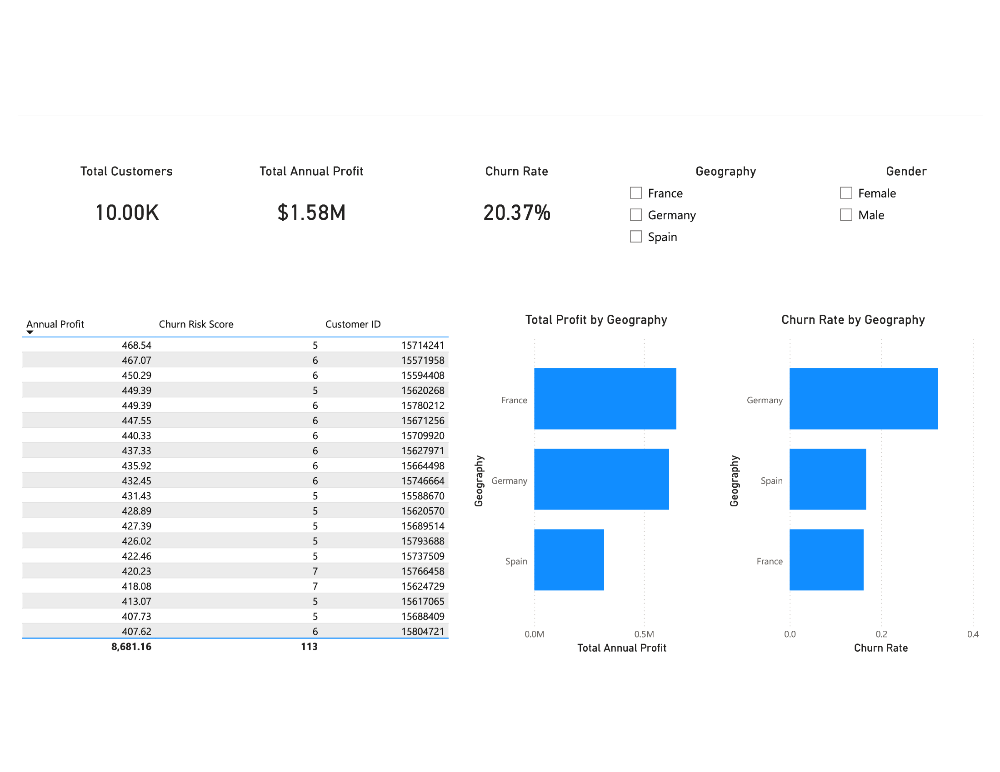
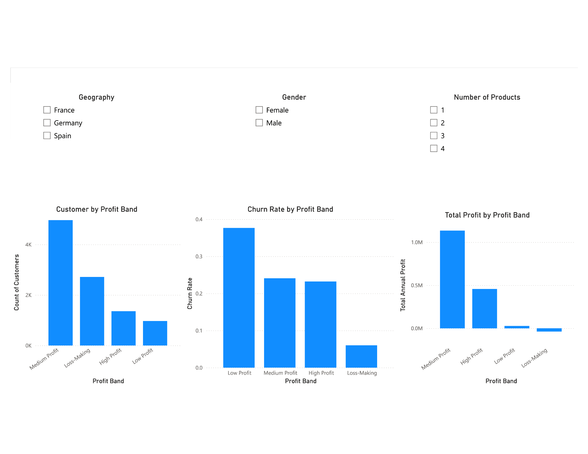

# 🏦 Bank Customer Churn and Profitability Analytics

## 📌 Project Overview
This project analyzes retail banking customers to understand **profitability drivers** and **churn risk** using **MySQL** and **Power BI**.

By designing a normalized SQL data model and applying **rule-based churn risk scoring**, the dashboards identify **high-value customers at risk of attrition** and surface insights to support data-driven retention strategies.

---

## 🛠️ Tools & Technologies
- **MySQL 8.0** – data modeling, transformations, analytical views  
- **Power BI Desktop** – interactive dashboards and reporting  
- **SQL** – joins, views, aggregations, business logic  
- **DAX** – calculated columns and measures for KPIs and segmentation  

---

## 📊 Dataset
- **Source:** Public bank churn dataset (Kaggle, *Churn Modelling*)
- **Records:** 10,000 retail banking customers
- **Features include:**
  - Demographics (age, gender, geography)
  - Account balance and salary
  - Product ownership
  - Activity status
  - Historical churn outcome

---

## 🗂️ Data Model
The project uses a **bank-style analytical schema** built in MySQL.

**Core components:**
- **Staging table** for raw churn data
- **Dimension tables**
  - Customer
  - Geography
- **Analytical SQL views**
  - Customer profile view
  - Profitability estimation view
  - Churn risk scoring view
  - High-value at-risk customer view

All business logic is implemented in SQL views to keep Power BI focused on visualization.

---

## 📐 Key Metrics & Logic
- **Annual Customer Profit**
  - Monthly account fee
  - Balance-based revenue proxy
  - Servicing and product costs
- **Churn Rate**
- **Rule-Based Churn Risk Score**
  - Activity status
  - Product count
  - Tenure
  - Balance presence
  - Credit score
- **Profitability Segments**
  - Loss-Making
  - Low Profit
  - Medium Profit
  - High Profit

---

## 📈 Dashboards

### 🔹 Executive Overview
High-level KPIs and trends for leadership decision-making.



---

### 🔹 Profitability & Segmentation
Customer value distribution and churn behavior across profit segments.


---

### 🔹 Churn Risk & Retention Actions
Drill-down analysis highlighting **high-value customers with elevated churn risk**.



---

## 💡 Key Insights
- **Medium and high-profit customers generate the majority of total profit**
- **Churn risk is significantly higher among low-profit and single-product customers**
- A subset of **high-profit customers shows elevated churn risk**, making them prime candidates for targeted retention outreach

---

## ⚠️ Assumptions & Limitations
- Profitability is estimated using simplified, explainable revenue and cost proxies
- Churn risk scoring is **rule-based**, prioritizing transparency over predictive complexity
- Churn labels are treated as historical outcomes provided by the dataset

---

## 🚀 Next Steps
- Incorporate **transaction-level data** to capture behavioral churn signals
- Introduce **predictive churn models** to complement rule-based scoring
- Simulate **retention interventions** and estimate ROI impact

---

## 📁 Repository Structure
```text
bank-customer-churn-analytics/
├── powerbi/
│   └── bank_customer_churn_profitability.pbix
├── sql/
│   ├── 01_create_database.sql
│   ├── 02_create_tables.sql
│   └── 03_create_views.sql
├── screenshots/
│   ├── Executive_Overview.png
│   ├── Profitability_and_Segmentation.png
│   └── Churn_Risk_and_Retention_Actions.png
└── README.md
```
---

## 📬 Contact
If you have questions about this project or would like to discuss analytics, data, or BI opportunities, feel free to reach out.

- **LinkedIn:** https://www.linkedin.com/in/collin-martin-6461482b5/
- **Email:** collin.martinn04@gmail.com

